# Edge Microvisor Toolkit Build Packages Flow

## Overview

This document provides a detailed architectural flow diagram for the Edge Microvisor Toolkit build process, specifically tracing the execution path when running:

```bash
sudo make build-packages REBUILD_TOOLS=y
```

The diagram shows the complete flow from repository clone to final RPM package generation, including all intermediate steps, tool builds, dependency resolution, and parallel processing.

## System Architecture Flow

```mermaid
graph TB
    Start([Git Clone Repository]) --> CheckEnv{Check Prerequisites}
    CheckEnv -->|Missing| InstallPrereq[Install Prerequisites:<br/>- Go >= 1.19<br/>- Docker/Podman<br/>- RPM tools<br/>- Build essentials]
    InstallPrereq --> MakeCommand
    CheckEnv -->|OK| MakeCommand
    
    MakeCommand([Execute: sudo make build-packages<br/>REBUILD_TOOLS=y]) --> ParseMakefile[Parse Makefile]
    
    ParseMakefile --> LoadIncludes[Load Include Files:<br/>- incremental_building.mk<br/>- tools.mk<br/>- toolchain.mk<br/>- chroot.mk<br/>- srpm_pack.mk<br/>- pkggen.mk]
    
    LoadIncludes --> SetVariables[Set Build Variables:<br/>REBUILD_TOOLS=y<br/>REBUILD_PACKAGES=y default<br/>REBUILD_TOOLCHAIN=n default<br/>SPECS_DIR, BUILD_DIR, OUT_DIR]
    
    SetVariables --> CheckRebuildTools{REBUILD_TOOLS=y?}
    
    %% Go Tools Build Branch
    CheckRebuildTools -->|Yes| CheckGoVersion{Go Version >= 1.19?}
    CheckGoVersion -->|No| ErrorGoVersion[ERROR: Go version too old]
    CheckGoVersion -->|Yes| GetGoDeps[Get Go Dependencies:<br/>go.mod, go.sum]
    
    GetGoDeps --> BuildGoTools[Build Go Tools in Parallel:<br/>- bldtracker<br/>- grapher<br/>- graphpkgfetcher<br/>- graphanalytics<br/>- graphPreprocessor<br/>- imageconfigvalidator<br/>- scheduler<br/>- pkgworker<br/>- specreader<br/>- srpmpacker<br/>- downloader<br/>- precacher<br/>- licensecheck<br/>... and 20+ more]
    
    BuildGoTools --> GoToolsOutput[Output: toolkit/out/tools/<br/>All Go binaries compiled]
    
    CheckRebuildTools -->|No| UseExistingTools[Use Existing Go Tools]
    UseExistingTools --> CheckToolchainStage
    GoToolsOutput --> CheckToolchainStage
    
    %% Toolchain Stage
    CheckToolchainStage{Check Toolchain Status} --> CheckRebuildToolchain{REBUILD_TOOLCHAIN?}
    
    CheckRebuildToolchain -->|y| BuildBootstrap[Build Bootstrap Toolchain:<br/>- Stage 1: Bootstrap container<br/>- Stage 2: Build gcc, glibc, binutils]
    BuildBootstrap --> BuildFinalToolchain[Build Final Toolchain RPMs:<br/>~200 toolchain packages]
    BuildFinalToolchain --> ToolchainRPMs[Output: build/toolchain_rpms/]
    
    CheckRebuildToolchain -->|n| DownloadToolchain[Download Toolchain RPMs:<br/>From: files-rs.edgeorchestration.intel.com]
    DownloadToolchain --> ValidateGPG{Validate GPG?}
    ValidateGPG -->|Yes| CheckGPGSig[Check GPG Signatures:<br/>INTEL-*-GPG-KEY*]
    CheckGPGSig -->|Invalid| ErrorGPG[ERROR: GPG validation failed]
    CheckGPGSig -->|Valid| ToolchainRPMs
    ValidateGPG -->|No| ToolchainRPMs
    
    ToolchainRPMs --> CreateChrootWorker
    
    %% Chroot Worker Creation
    CreateChrootWorker[Create Chroot Worker:<br/>create_worker_chroot.sh] --> ExtractToolchainRPMs[Extract Toolchain RPMs:<br/>Based on pkggen_core_*.txt manifest]
    
    ExtractToolchainRPMs --> BuildChrootTarball[Build Worker Chroot Tarball:<br/>build/worker/worker_chroot.tar.gz]
    
    BuildChrootTarball --> ValidateChroot[Validate Chroot:<br/>Run go-validatechroot]
    
    ValidateChroot --> ChrootReady[Chroot Worker Ready]
    
    %% SRPM Packing Stage
    ChrootReady --> CheckSRPMList{SRPM_PACK_LIST<br/>specified?}
    
    CheckSRPMList -->|Yes| FilterSpecs[Filter SPECS:<br/>Only selected packages]
    CheckSRPMList -->|No| AllSpecs[Scan All SPECS/<br/>~193 packages]
    
    FilterSpecs --> RunSRPMPacker
    AllSpecs --> RunSRPMPacker
    
    RunSRPMPacker[Run srpmpacker Tool] --> DownloadSources{Sources Available<br/>Locally?}
    
    DownloadSources -->|No| FetchSources[Fetch Sources:<br/>From SOURCE_URL or upstream]
    FetchSources --> ValidateSignatures
    DownloadSources -->|Yes| ValidateSignatures
    
    ValidateSignatures[Validate Source Signatures:<br/>Check *.signatures.json<br/>SHA256 hashes]
    
    ValidateSignatures -->|Invalid| ErrorSignature[ERROR: Signature mismatch]
    ValidateSignatures -->|Valid| PackSRPMs
    
    PackSRPMs[Pack Source RPMs:<br/>rpmbuild -bs in chroot] --> SRPMsReady[Output: build/INTERMEDIATE_SRPMS/<br/>*.src.rpm files]
    
    %% Package Dependency Analysis Stage
    SRPMsReady --> ParseSpecs[Parse Specs Phase:<br/>run go-specreader]
    
    ParseSpecs --> ExtractDeps[Extract from each .spec:<br/>- BuildRequires<br/>- Requires<br/>- Provides<br/>- Conflicts<br/>- Version info]
    
    ExtractDeps --> GenerateSpecsJSON[Generate specs.json:<br/>build/pkg_artifacts/specs.json<br/>All dependency metadata]
    
    GenerateSpecsJSON --> RunGrapher[Run go-grapher:<br/>Build Dependency Graph]
    
    RunGrapher --> CreateDepGraph[Create graph.dot:<br/>- Nodes = packages<br/>- Edges = dependencies<br/>- Detect cycles]
    
    CreateDepGraph --> ResolveCycles{Cycles Detected?}
    
    ResolveCycles -->|Yes + RESOLVE_CYCLES| ResolveFromUpstream[Resolve Cycles:<br/>Use upstream RPMs]
    ResolveCycles -->|Yes + No Resolve| ErrorCycle[ERROR: Circular dependency]
    ResolveCycles -->|No| GraphComplete
    
    ResolveFromUpstream --> GraphComplete[Graph Complete:<br/>build/pkg_artifacts/graph.dot]
    
    %% Package Cache Phase
    GraphComplete --> RunGraphPkgFetcher[Run go-graphpkgfetcher:<br/>Populate RPM Cache]
    
    RunGraphPkgFetcher --> CreateCacheWorker[Create tdnf_cache_worker:<br/>Temporary chroot for tdnf]
    
    CreateCacheWorker --> ConfigureRepos[Configure Repositories:<br/>- local.repo<br/>- fetcher.repo<br/>- REPO_LIST<br/>- Upstream repos]
    
    ConfigureRepos --> FetchPackages[Fetch Dependency RPMs:<br/>Using tdnf in cache_worker]
    
    FetchPackages --> CheckConfigFile{CONFIG_FILE<br/>specified?}
    
    CheckConfigFile -->|Yes| FilterByConfig[Filter Packages:<br/>Only needed for image config]
    CheckConfigFile -->|No| FetchAllDeps[Fetch All Dependencies]
    
    FilterByConfig --> CacheRPMs
    FetchAllDeps --> CacheRPMs
    
    CacheRPMs[Cache RPMs:<br/>build/rpm_cache/cache/] --> GenerateCachedGraph[Generate cached_graph.dot:<br/>Mark cached vs. to-build]
    
    GenerateCachedGraph --> RunPreprocessor[Run go-graphPreprocessor:<br/>Remove cached packages from build]
    
    RunPreprocessor --> PreprocessedGraph[Generate preprocessed_graph.dot:<br/>Final build plan]
    
    %% Package Build Scheduling Phase
    PreprocessedGraph --> RunScheduler[Run go-scheduler:<br/>Orchestrate Package Builds]
    
    RunScheduler --> ParseBuildPlan[Parse Build Plan:<br/>- Topological sort<br/>- Identify buildable packages<br/>- Create work queue]
    
    ParseBuildPlan --> DetermineConcurrency[Determine Parallelism:<br/>CONCURRENT_PACKAGE_BUILDS<br/>Default: nproc]
    
    DetermineConcurrency --> CreateBuildWorkers[Create Build Workers:<br/>N parallel chroot environments]
    
    CreateBuildWorkers --> WorkerLoop{More Packages<br/>to Build?}
    
    WorkerLoop -->|Yes| CheckDepsReady{Dependencies<br/>Built?}
    
    CheckDepsReady -->|No| WaitQueue[Wait in Queue]
    WaitQueue --> CheckDepsReady
    
    CheckDepsReady -->|Yes| AssignWorker[Assign to Available Worker]
    
    AssignWorker --> SetupBuildChroot[Setup Build Chroot:<br/>1. Extract worker_chroot.tar.gz<br/>2. Mount /proc, /sys, /dev<br/>3. Install dependencies<br/>4. Copy SRPM]
    
    SetupBuildChroot --> RunPkgWorker[Run go-pkgworker in Chroot:<br/>rpmbuild package]
    
    RunPkgWorker --> RPMBuild[rpmbuild -bb:<br/>1. %prep - unpack sources<br/>2. %build - compile<br/>3. %install - install to buildroot<br/>4. %check - run tests if RUN_CHECK=y<br/>5. Create RPM]
    
    RPMBuild --> CheckBuildResult{Build Success?}
    
    CheckBuildResult -->|Failed| CheckRetries{Retries<br/>Available?}
    CheckRetries -->|Yes| RetryBuild[Retry Build:<br/>PACKAGE_BUILD_RETRIES]
    RetryBuild --> SetupBuildChroot
    CheckRetries -->|No| LogFailure[Log Build Failure:<br/>logs/pkggen/failures.txt]
    
    LogFailure --> CheckStopOnFail{STOP_ON_PKG_FAIL?}
    CheckStopOnFail -->|Yes| ErrorBuildFail[ERROR: Build failed, stopping]
    CheckStopOnFail -->|No| MarkFailed[Mark Package Failed:<br/>Continue with other packages]
    MarkFailed --> WorkerLoop
    
    CheckBuildResult -->|Success| CopyRPMs[Copy RPMs:<br/>build chroot → out/RPMS/]
    
    CopyRPMs --> RunLicenseCheck{LICENSE_CHECK_MODE<br/>!= none?}
    
    RunLicenseCheck -->|Yes| CheckLicenses[Run go-licensecheck:<br/>Validate license files<br/>in RPM]
    CheckLicenses -->|Fatal Error| ErrorLicense[ERROR: License validation failed]
    CheckLicenses -->|Warning/OK| UpdateGraph
    RunLicenseCheck -->|No| UpdateGraph
    
    UpdateGraph[Update Build Graph:<br/>Mark package as built<br/>Unlock dependent packages] --> CleanupChroot[Cleanup Build Chroot:<br/>Unmount, remove temp files]
    
    CleanupChroot --> WorkerLoop
    
    WorkerLoop -->|No| GenerateBuildState[Generate Build State:<br/>build_state.csv<br/>built_graph.dot]
    
    GenerateBuildState --> CheckAllBuilt{All Required<br/>Packages Built?}
    
    CheckAllBuilt -->|No + Blocked| AnalyzeFailures[Analyze Blocked Packages:<br/>go-graphanalytics]
    AnalyzeFailures --> ReportFailures[Report:<br/>- Failed packages<br/>- Blocking reasons<br/>- Dependency chains]
    ReportFailures --> ErrorNotAllBuilt[ERROR: Not all packages built]
    
    CheckAllBuilt -->|Yes| CopyToOut[Copy RPMs to out/RPMS/:<br/>Organize by architecture:<br/>- x86_64/<br/>- noarch/]
    
    CopyToOut --> GenerateSRPMs[Copy SRPMs to out/SRPMS/:<br/>Source RPMs for distribution]
    
    GenerateSRPMs --> UpdateLocalRepo[Update Local Repository:<br/>createrepo_c for local.repo]
    
    UpdateLocalRepo --> GenerateSummary[Generate Build Summary:<br/>- Total packages built<br/>- Build time<br/>- Cache statistics<br/>- Failure summary]
    
    GenerateSummary --> BuildComplete([Build Complete])
    
    BuildComplete --> OutputStructure[Output Structure:<br/><br/>out/RPMS/<arch>/*.rpm<br/>out/SRPMS/*.src.rpm<br/>build/logs/pkggen/<br/>build/pkg_artifacts/]
    
    %% Styling
    classDef errorStyle fill:#ffcccc,stroke:#ff0000,stroke-width:2px
    classDef successStyle fill:#ccffcc,stroke:#00aa00,stroke-width:2px
    classDef processStyle fill:#cce5ff,stroke:#0066cc,stroke-width:2px
    classDef decisionStyle fill:#fff4cc,stroke:#ffaa00,stroke-width:2px
    classDef outputStyle fill:#e6ccff,stroke:#9933ff,stroke-width:2px
    
    class ErrorGoVersion,ErrorGPG,ErrorSignature,ErrorCycle,ErrorBuildFail,ErrorLicense,ErrorNotAllBuilt errorStyle
    class BuildComplete,BuildGoTools,ToolchainRPMs,SRPMsReady,CopyToOut,BuildComplete successStyle
    class RunScheduler,RunPkgWorker,RPMBuild,ParseSpecs,RunGrapher processStyle
    class CheckRebuildTools,CheckRebuildToolchain,ValidateGPG,CheckDepsReady,CheckBuildResult decisionStyle
    class OutputStructure,GoToolsOutput,ChrootReady,PreprocessedGraph outputStyle
```



## Detailed Component Descriptions

### 1. Prerequisites & Initialization Phase

**Repository Clone:**
- User clones `edge-microvisor-toolkit` repository
- Changes to `toolkit/` directory
- All subsequent build commands executed from this location

**Environment Checks:**
- Verifies Go version >= 1.19 (from `go.mod`)
- Checks for required build tools (rpm, rpmbuild, make, gcc)
- Verifies Docker/Podman for container-based builds

### 2. Makefile Processing Phase

**Include Chain:**
```
Makefile (root)
  ├── incremental_building.mk  - Auto-configure optimization flags
  ├── tools.mk                 - Go tool compilation
  ├── toolchain.mk             - Toolchain download/build
  ├── chroot.mk                - Chroot worker creation
  ├── srpm_pack.mk             - Source RPM packing
  └── pkggen.mk                - Package building orchestration
```

**Variable Resolution:**
- `REBUILD_TOOLS=y` → Force rebuild all Go tools
- `REBUILD_PACKAGES=y` (default) → Build packages from source
- `REBUILD_TOOLCHAIN=n` (default) → Download prebuilt toolchain
- `CONFIG_FILE=""` (default) → Build all packages, not image-specific

### 3. Go Tools Build Phase

**Tools Built (27 total):**

| Tool | Purpose |
|------|---------|
| `srpmpacker` | Create source RPMs from SPECS |
| `specreader` | Parse .spec files, extract dependencies |
| `grapher` | Build package dependency graph |
| `graphpkgfetcher` | Download dependency RPMs from repos |
| `graphPreprocessor` | Optimize build graph |
| `scheduler` | Orchestrate parallel package builds |
| `pkgworker` | Execute rpmbuild in chroot |
| `downloader` | Download sources and packages |
| `licensecheck` | Validate license compliance |
| `imagecustomizer` | Customize OS images |
| `imagegen` | Generate bootable images |
| ... and 16+ more |

**Compilation:**
- All tools built in parallel using `go build`
- Output: `toolkit/out/tools/<tool-name>`
- Common dependencies: `internal/`, `pkg/`, `grapher/`

### 4. Toolchain Stage

**Option A: Download Toolchain (default, REBUILD_TOOLCHAIN=n)**
1. Fetch RPM list from `TOOLCHAIN_MANIFEST` (~200 packages)
2. Download from `https://files-rs.edgeorchestration.intel.com/files-edge-orch/microvisor/rpms/`
3. Optionally validate GPG signatures (on by default)
4. Extract to `build/toolchain_rpms/<arch>/`

**Option B: Build Toolchain (REBUILD_TOOLCHAIN=y)**
1. **Bootstrap Phase:**
   - Build minimal container with gcc stage 1
   - Cross-compile initial toolchain
2. **Official Toolchain:**
   - Use bootstrap to build final gcc, glibc, binutils
   - Build ~200 toolchain packages serially
   - Output to `build/toolchain_rpms/`

**Packages Include:**
- gcc, g++, glibc, binutils, make, cmake
- Kernel headers, rpm tools, tar, gzip
- Python, Perl, Bash, Coreutils

### 5. Chroot Worker Creation

**Purpose:** Create isolated build environment

**Process:**
1. Read `pkggen_core_*.txt` manifest (minimal package set)
2. Extract selected RPMs from toolchain to temporary directory
3. Create filesystem structure (`/usr`, `/etc`, `/var`, `/tmp`)
4. Install RPM database
5. Configure minimal `/etc/` files
6. Compress to `build/worker/worker_chroot.tar.gz`

**Validation:**
- Run `go-validatechroot` to verify completeness
- Check for required binaries (`rpm`, `rpmbuild`, `bash`)
- Verify library dependencies

### 6. SRPM Packing Phase

**For Each .spec File:**

1. **Source Discovery:**
   - Read `Source0:`, `Source1:`, etc. from .spec
   - Read `Patch0:`, `Patch1:`, etc.
   - Check local SPECS directory first
   - Download missing sources from `SOURCE_URL` or upstream

2. **Signature Validation:**
   - Calculate SHA256 of each source file
   - Compare against `*.signatures.json`
   - `SRPM_FILE_SIGNATURE_HANDLING=enforce` (default)
     - Mismatch = build fails
   - `=update` → Update .signatures.json with new hashes
   - `=skip` → No validation

3. **SRPM Creation:**
   - Execute `rpmbuild -bs` in chroot
   - Combine .spec + sources → .src.rpm
   - Output: `build/INTERMEDIATE_SRPMS/<name>-<ver>-<rel>.src.rpm`

### 7. Dependency Analysis Phase

**Step 1: Parse Specs (specreader)**
```
Input:  All .spec files in SPECS/
Output: build/pkg_artifacts/specs.json

JSON Structure:
{
  "packages": [
    {
      "name": "kernel",
      "version": "6.12.0",
      "release": "1",
      "buildRequires": ["gcc", "make", ...],
      "requires": ["initramfs-tools", ...],
      "provides": ["kernel", "kernel-core"]
    },
    ...
  ]
}
```

**Step 2: Build Graph (grapher)**
```
Input:  specs.json
Output: graph.dot (GraphViz format)

Graph Structure:
- Nodes = package name + version
- Edges = dependency relationships
  - Build-time: BuildRequires
  - Runtime: Requires
- Detect circular dependencies
- Flag packages that need external resolution
```

**Cycle Resolution:**
- Circular deps are common (e.g., A requires B, B build-requires A)
- Resolution strategies:
  1. Use toolchain version of A to build B
  2. Use upstream RPM from repo
  3. If `RESOLVE_CYCLES_FROM_UPSTREAM=y`, fetch from remote
  4. Otherwise, fail with error

**Step 3: Cache Population (graphpkgfetcher)**
```
For each package in graph:
  If package not in local RPMS/
    and not in build list:
      Download from repository
      Cache in build/rpm_cache/cache/
```

**Repositories Checked (in order):**
1. Local built RPMs (`out/RPMS/`)
2. Toolchain RPMs (`build/toolchain_rpms/`)
3. Cached RPMs (`build/rpm_cache/`)
4. Intel EMT repo (base + debuginfo)
5. Azure Linux upstream (if not disabled)
6. Preview repo (if `USE_PREVIEW_REPO=y`)

**Step 4: Preprocessing (graphPreprocessor)**
```
Input:  cached_graph.dot
Output: preprocessed_graph.dot

Operations:
- Remove nodes for cached packages
- Remove nodes in PACKAGE_IGNORE_LIST
- Add nodes in PACKAGE_BUILD_LIST
- Force rebuild for PACKAGE_REBUILD_LIST
- Recompute dependency edges
- Topologically sort remaining nodes
```

### 8. Package Build Scheduling Phase

**Scheduler Algorithm:**

```python
# Pseudocode representation

buildQueue = []
builtPackages = set()
failedPackages = set()
workers = [Worker(1), Worker(2), ..., Worker(N)]  # N = CONCURRENT_PACKAGE_BUILDS

# Initialize queue with packages that have no dependencies
for pkg in graph.packages:
    if pkg.dependencies.all_satisfied():
        buildQueue.append(pkg)

while buildQueue or any_worker_busy():
    for worker in workers:
        if worker.idle() and buildQueue:
            pkg = buildQueue.pop(0)
            worker.build(pkg)
    
    # Check completed builds
    for worker in workers:
        if worker.finished():
            result = worker.get_result()
            if result.success:
                builtPackages.add(result.package)
                # Unlock dependent packages
                for dep in graph.dependents_of(result.package):
                    if dep.dependencies.all_satisfied():
                        buildQueue.append(dep)
            else:
                if result.retries_available:
                    buildQueue.append(result.package)
                else:
                    failedPackages.add(result.package)
                    if STOP_ON_PKG_FAIL:
                        abort()

return builtPackages, failedPackages
```

**Worker Build Process:**

```bash
# For each package build:

1. Create isolated chroot:
   mkdir -p build/worker/chroot/<worker-id>/<package-name>
   cd build/worker/chroot/<worker-id>/<package-name>
   tar -xzf worker_chroot.tar.gz

2. Mount pseudo-filesystems:
   mount -t proc proc proc/
   mount -t sysfs sysfs sys/
   mount -t devtmpfs devtmpfs dev/

3. Install build dependencies:
   # Copy required RPMs into chroot
   for dep in package.buildRequires:
       cp build/rpm_cache/cache/$dep*.rpm chroot/tmp/
   
   # Install in chroot
   chroot . rpm -ivh /tmp/*.rpm

4. Copy SRPM:
   cp build/INTERMEDIATE_SRPMS/<pkg>.src.rpm chroot/usr/src/

5. Execute build:
   chroot . rpmbuild --rebuild /usr/src/<pkg>.src.rpm
   
   # rpmbuild stages:
   %prep    - Unpack sources, apply patches
   %build   - ./configure && make
   %install - make install DESTDIR=$RPM_BUILD_ROOT
   %check   - make test (if RUN_CHECK=y)
   %files   - List files to package
   
   # Output: /root/rpmbuild/RPMS/<arch>/<pkg>.rpm

6. Extract built RPMs:
   cp chroot/root/rpmbuild/RPMS/*/*.rpm out/RPMS/

7. Cleanup:
   umount chroot/proc chroot/sys chroot/dev
   rm -rf chroot/
```

**Parallel Execution:**
- Default: `nproc` workers (one per CPU core)
- Each worker has independent chroot
- Scheduler ensures dependency order respected
- Build logs: `build/logs/pkggen/rpmbuilding/<pkg>.log`

### 9. Build Monitoring & Error Handling

**Build Retries:**
- `PACKAGE_BUILD_RETRIES=0` (default) → One attempt
- Retries useful for transient failures (network, disk I/O)
- Failed retries logged to `logs/pkggen/failures.txt`

**Failure Analysis:**
```
When build completes:
1. Run go-graphanalytics on built_graph.dot
2. Identify:
   - Directly failed packages (compilation errors)
   - Blocked packages (dependency failures)
   - Orphaned packages (circular dep issues)
3. Generate report:
   - Failure reason for each package
   - Dependency chain that caused block
   - Suggested remediation
```

**License Checking:**
```
If LICENSE_CHECK_MODE != none:
  For each built RPM:
    1. Extract RPM contents
    2. Check for license files:
       - /usr/share/licenses/<pkg>/
       - /usr/share/doc/<pkg>/LICENSE
    3. Validate against:
       - license_file_names.json (expected filenames)
       - license_file_exceptions.json (known exceptions)
    4. Mode behavior:
       - warn: Log issues, continue
       - fatal: Stop on first issue
       - pedantic: Stop on warnings too
```

### 10. Output Generation

**Final Outputs:**

```
out/
├── RPMS/
│   ├── x86_64/
│   │   ├── kernel-6.12.0-1.x86_64.rpm
│   │   ├── gcc-13.2.0-1.x86_64.rpm
│   │   └── ... (architecture-specific)
│   └── noarch/
│       ├── python3-pip-24.0-1.noarch.rpm
│       └── ... (architecture-independent)
├── SRPMS/
│   ├── kernel-6.12.0-1.src.rpm
│   └── ... (source RPMs)
└── images/
    └── (empty, populated by 'make image')

build/
├── pkg_artifacts/
│   ├── specs.json              - Parsed spec metadata
│   ├── graph.dot               - Initial dependency graph
│   ├── cached_graph.dot        - Graph with cached packages
│   ├── preprocessed_graph.dot  - Final build plan
│   ├── built_graph.dot         - Build results
│   ├── build_state.csv         - Per-package build status
│   └── license_issues.json     - License validation results
├── logs/
│   └── pkggen/
│       ├── workplan/           - Dependency analysis logs
│       ├── rpmbuilding/        - Per-package build logs
│       └── failures.txt        - Build failure summary
├── rpm_cache/
│   └── cache/                  - Downloaded dependency RPMs
├── toolchain_rpms/             - Toolchain packages
└── worker/
    └── worker_chroot.tar.gz    - Reusable build environment
```

## Build Time Estimates

| Phase | Typical Duration | Notes |
|-------|-----------------|-------|
| Go Tools Build | 2-5 minutes | Parallel compilation |
| Toolchain Download | 5-10 minutes | ~2GB download |
| Toolchain Build | 2-4 hours | Only if REBUILD_TOOLCHAIN=y |
| SRPM Packing | 5-15 minutes | Depends on source download speed |
| Dependency Analysis | 2-5 minutes | Graph computation + cache population |
| Package Building | 30 min - 4 hours | Varies by package count and parallelism |
| **Total (typical)** | **1-2 hours** | With downloaded toolchain, j=$(nproc) |
| **Total (full rebuild)** | **4-8 hours** | With toolchain rebuild |

## Optimization Strategies

### 1. Quick Rebuild Mode
```bash
sudo make build-packages QUICK_REBUILD_PACKAGES=y
```
- Sets `DELTA_FETCH=y` → Only download needed packages
- Sets `PRECACHE=y` → Pre-populate cache
- Sets `MAX_CASCADING_REBUILDS=1` → Limit rebuilds

### 2. Targeted Build
```bash
sudo make build-packages REBUILD_TOOLS=y SRPM_PACK_LIST="kernel openssh"
```
- Only builds specified packages + dependencies
- Significantly faster than full build

### 3. Use Build Cache
```bash
sudo make build-packages REBUILD_TOOLS=y USE_PACKAGE_BUILD_CACHE=y
```
- Reuse previously built packages
- Only rebuild changed specs

### 4. Disable Checks
```bash
sudo make build-packages REBUILD_TOOLS=y RUN_CHECK=n
```
- Skip %check section in specs
- Faster builds, but less validation

### 5. Hydrated Build
```bash
sudo make build-packages REBUILD_TOOLS=y HYDRATED_BUILD=y
```
- Assumes all dependencies pre-downloaded
- Skips network operations during build

## Common Issues & Troubleshooting

### Issue: Go version too old
```
Error: Go version 'go1.18' is less than minimum required version 'go1.19'
Solution: sudo make install-prereqs
```

### Issue: Toolchain download fails
```
Error: Failed to download toolchain RPMs
Solution: Check network, or set ALLOW_TOOLCHAIN_DOWNLOAD_FAIL=y
```

### Issue: Circular dependency
```
Error: Package 'A' has circular dependency with 'B'
Solution: Set RESOLVE_CYCLES_FROM_UPSTREAM=y
```

### Issue: Package build fails
```
Error: Package 'foo' failed to build
Debug: Check build/logs/pkggen/rpmbuilding/foo.log
Common causes:
  - Missing BuildRequires
  - Compilation errors
  - Test failures (set RUN_CHECK=n to skip)
```

### Issue: Out of disk space
```
Error: No space left on device
Solution: 
  - Clean build artifacts: sudo make clean
  - Free space needed: ~50GB for full build
  - Set CLEANUP_PACKAGE_BUILDS=y to auto-cleanup
```

## Key Architectural Decisions

### Why Go for Build Tools?
- Fast compilation
- Excellent concurrency support
- Cross-platform compatibility
- Static binaries (no runtime dependencies)

### Why Chroot Instead of Containers?
- Lighter weight than full containers
- Faster setup/teardown
- Native kernel access (needed for kernel builds)
- Still provides isolation

### Why Graph-Based Build?
- Optimal parallelization
- Automatic dependency ordering
- Cycle detection
- Incremental builds (only rebuild affected packages)

### Why Three-Stage Build?
- **Toolchain:** Stable foundation, rarely changes
- **Packages:** Frequent updates, parallel builds
- **Images:** Fast generation from built packages

## References

- Main Makefile: `toolkit/Makefile`
- Package build logic: `toolkit/scripts/pkggen.mk`
- Go tools: `toolkit/tools/`
- Build documentation: `toolkit/docs/building/building.md`
- Architecture overview: `docs/developer-guide/emt-architecture-overview.md`

---

**Document Version:** 1.0  
**Last Updated:** 2026-05-07  
**Maintainer:** Edge Microvisor Toolkit Team
